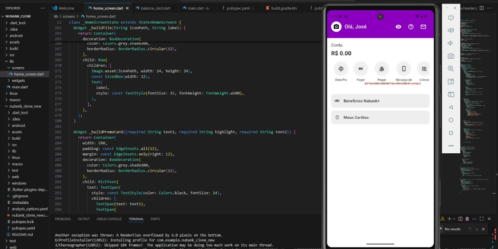

# 📱 Nubank Clone (Flutter) – *Projeto de Estudo*



Este é um projeto pessoal de estudo com o objetivo de **replicar a interface do app bancário Nubank utilizando Flutter**.  
Foi desenvolvido como forma de praticar o uso de componentes visuais, widgets personalizados, manipulação de estados e construção de UI moderna com base em um app real do mercado.

> ⚠️ **Aviso**: Este projeto **não é um aplicativo oficial do Nubank**, e **não está 100% finalizado** devido a alguns erros e limitações que encontrei durante o processo. Mesmo assim, ele representa uma etapa importante na minha jornada de aprendizado com Flutter.

---

## 🚧 Status do Projeto

🟣 **Em andamento (parcialmente funcional)**  
Algumas seções da interface estão prontas, como:
- Cabeçalho com saudação e foto de perfil;
- Visualização e edição do saldo;
- Lista de atalhos (Pix, Pagar, Cobrar, etc);
- Sessões de benefícios e frases promocionais.

❌ A seção de cartões ainda não está funcional, e houve problemas com sobreposição de widgets (`overflow`) que interromperam o desenvolvimento completo da interface.

---

## 🚀 Tecnologias utilizadas

- **Flutter** 3.x
- **Dart**
- **image_picker**
- Layout inspirado no design do Nubank (cores, ícones e estilo visual)

---

## 📦 Como executar o projeto

1. Clone o repositório:
   ```bash
   git clone https://github.com/seu-usuario/nubank_clone.git
   cd nubank_clone
   ```

2. Instale as dependências:
   ```bash
   flutter pub get
   ```

3. Rode no emulador ou dispositivo:
   ```bash
   flutter run
   ```

---

## 🎯 Objetivo

Este projeto teve como propósito:
- Aprender a estruturar interfaces complexas com Flutter;
- Reproduzir layouts modernos baseados em apps reais;
- Experimentar o uso de `StatefulWidget`, `ImagePicker`, `AlertDialog` e `ListView` horizontal.

---

## 🧑‍💻 Autor

Desenvolvido por **[Seu Nome ou @seu-usuário no GitHub]**  
📌 Este projeto é parte do meu portfólio de aprendizado em desenvolvimento mobile.

---

## 🛑 Aviso Legal

Este projeto não possui nenhuma relação com o Nubank. É apenas uma réplica parcial, **feita para fins de estudo**, sem uso comercial.